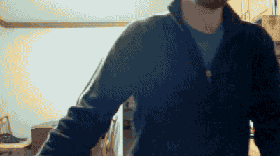

Here's the end result:

Screensaver
===========

To use this composition as your screensaver, save `deal with it.qtz` to `~/Library/Screen Savers/`. You can use the install script `install.sh` by running `./install.sh` in Terminal from the folder you save this repo to. The install directory is a hidden, in order to manually install you may have to get to it by opening Finder and typing `shift-command-G` and manually typing the screen saver directory name.
